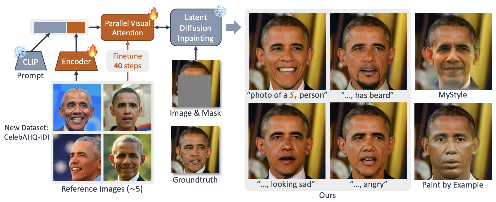
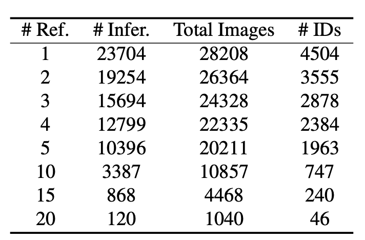

# Personalized Face Inpainting with Diffusion Models by Parallel Visual Attention (WACV2024)

Jianjin Xu, Saman Motamed, Praneetha Vaddamanu, Chen Henry Wu, Christian Haene, Jean-Charles Bazin, Fernando de la Torre



## CelebAHQ-IDI Dataset

CelebAHD IDentity Preserving Inpainting (CelebAHQ-IDI) dataset is organized from original CelebAHQ dataset, also with language annotations from CelebA-Dialog dataset.
The statistics of this dataset is shown in the table below.
`#Ref` refers to the number of reference images available.
For example, `#Ref=1` means that for each identity, there are two or more images and one image is used as reference and the rest are for inference.

This dataset can not only be used to train and evaluate identity-preserving inpainting, but also train and evaluate personalized generative models, such as Stable Diffusion with Textual Inversion and LoRA, etc.

The dataset can be obtained from [Google Drive](https://drive.google.com/drive/folders/1WIds-CixO_2obprhuyatWB8m1y9D0_Zn?usp=sharing).



## Setup

- Install requirements.
- Download the dataset and uncompress it under `data/` folder.

## Training

We support multi-GPU parallelization with huggingface accelerate.

```bash
# Train the PVA pathway: stage 1
python script/pva_train.py --config config/SDI2_PVA_stage1.json 
# stage 2
python script/pva_train.py --config config/SDI2_PVA_stage2.json --resume expr/celebahq/PVA/stage1/

# Reproducing Textual Inversion baselines on CelebAHQ-IDI-5
python script/finetune.py

# Reproducing Custom Diffusion baselines on CelebAHQ-IDI-5
python script/submit.py --func cdi_train --gpu <0/1>

# Reproducing PVA with 20 steps of finetuning
python script/finetune.py --config config/SDI2_PVA_FT.json --resume expr/celebahq/PVA/stage2/
```

